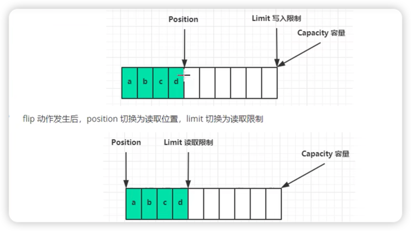

#ByteBuffer正确使用姿势
1. 向buffer写入数据,例如channel.read(buffer)
2. 调用flip切换至读模式(必不可少)
3. 从buffer读取数据,例如调用buffer.get()
4. 调用clear()或compact()切换至写模式
5. 重复1-4步骤

为什么要反复切换读写模式

#ByteBuffer内存模式
关键属性
* capacity:容量
* position 当前读/写位置,同一个位置表示读写
* limit :限制数,可读/可写数

ByteBuffer 假设10个容量,
初始化状态:
* capacity:10
* position:0
* limit : 10

#常见操作方法
flip()

clear():切换至写模式

compact():把未读的数据向前压缩,然后切换至写模式

get()
读取当前posotion位置数据,position++
position++
  