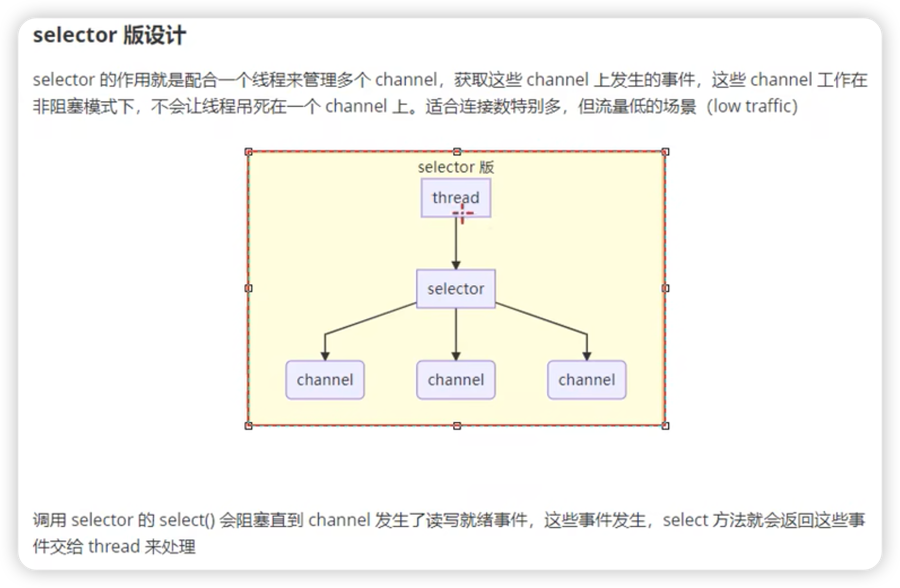

NIO

非阻塞 IO

# 3大组件
##Channel
传输通道,双向通道

文件通道
UDP传输通道
TCP传输通道
--SocketChannel
--ServerSocketChannel
##Buffer
内存缓存区
ByteBuffer
--MappedByteBuffer
--HeapByteBuffer
--DirectByteBuffer

ShortBuffer
IntBuffer
LongBuffer
FloatBuffer
DoubleBuffer

## Selector
选择器 
多路复用

###从服务器设计演化理解他的用途

1.多线程版本设计
BIO+多线程

适合场景
连接数少的场景
缺点:
高并发下
* 线程数多,内存占用高(window一个线程占用内存数:1M)
* 线程上下文切换成本高

1.1进阶版
BIO+线程池

适合场景:短连接场景
缺点:
* BIO阻塞模式下,线程同一时刻只能处理一个socket连接

2.selector版本设计
一个selector使用一个线程监听多个channel事件

适合场景:连接数多,但流量低
调用Selector的selector方法

