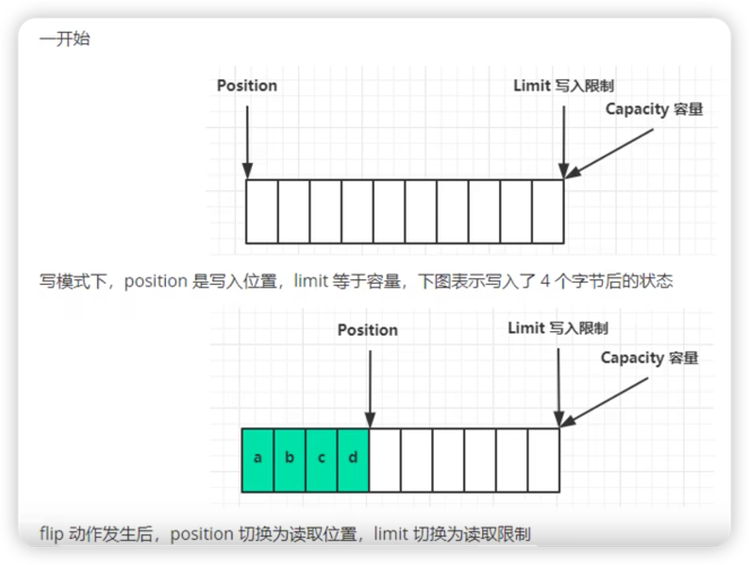
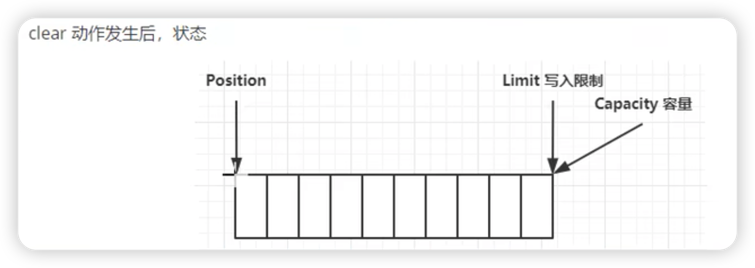
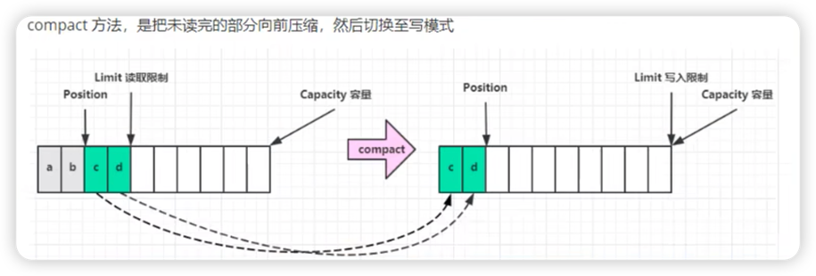

#ByteBuffer

#内存类型
HeapByteBuffer: java堆内存,读写效率相对较低,jvm GC影响
DirectByteBuffer:直接内存,系统内存,读写效率高(少一次拷贝),无jvm GC影响;分配效率低一些,需要注意手动内存回收
#ByteBuffer正确使用姿势
1. 向buffer写入数据,例如channel.read(buffer)
2. 调用flip切换至读模式(必不可少)
3. 从buffer读取数据,例如调用buffer.get()
4. 调用clear()或compact()切换至写模式
5. 重复1-4步骤


为什么要反复切换读写模式

#ByteBuffer内存模式
关键属性
* capacity:容量
* position 当前读/写位置,同一个位置表示读写
* limit :限制数,可读/可写限制数

* mark:标记位置

ByteBuffer 假设10个容量,
初始化状态:
* capacity:10
* position:0
* limit : 10






#常见方法
##分配方法allocate
```
ByteBuffer.allocate(10);
ByteBuffer.allocateDirect(10);
```
特性:不能动态调整内存缓存区大小,netty后面有做增强
##向buffer写入数据
* 1.调用channel的read方法(channel读出来,向buffer写进去,一进一出)
* 2.调用buffer的put方法
```
int readBytes = channel.read(buffer);
```
```
buffer.put((byte)127);
```
##向buffer读取数据
* 1. channel的write方法(channel写进去,从buffer读出来,一进一出)
* 2. buffer的get方法:读取当前position位置数据,position++
```
int writeBytes = channel.write(buffer);
```    
```
byte b = buffer.get();
```
问题:如果想重复读怎么办？
* 1.buffer的rewind方法将position设置为0,重头开始读
* 2.buffer的get(index)获取指定位置的内容,不会改变position值

## 标记方法
* mark:标记当前position位置
* reset:回退到mark方法标记位置, 一般搭配mark方法使用,效果更佳
##操作方法
上面有示意图,更清晰
flip()
:切换至读模式

clear():切换至写模式

compact():把未读的数据向前压缩,然后切换至写模式


  